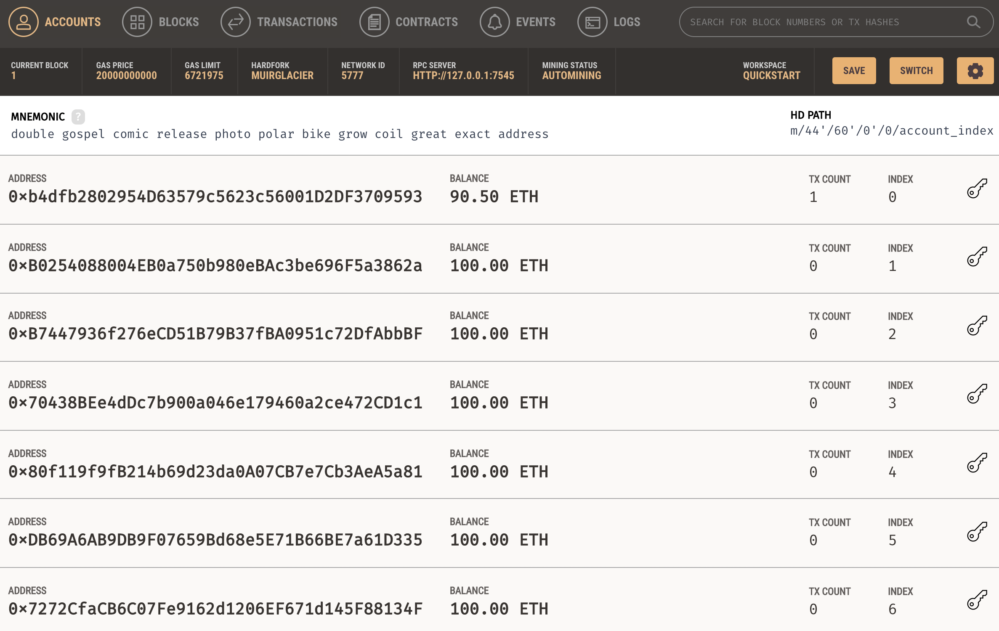
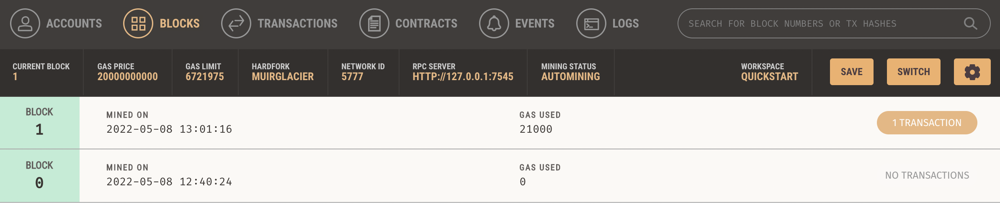
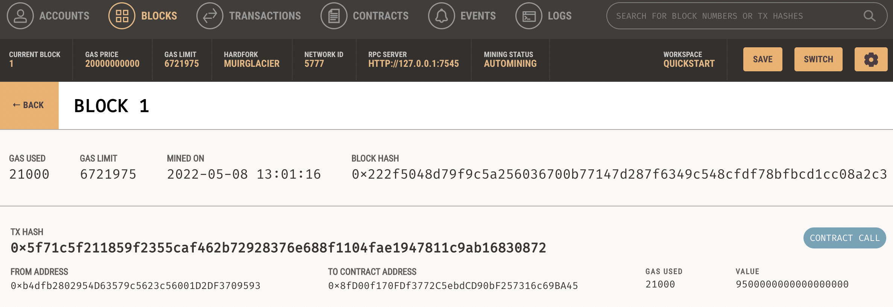
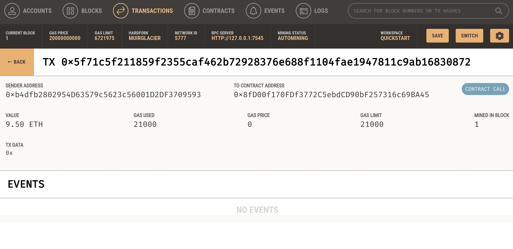

# 19_Fintech_Finder

### This project aims to build a Fintech Finder application where customers can use to find fintech professionals from among a list of candidates, hire them, and pay them. This tool integrates the Ethereum blockchain network into the application in order to enable customers to instantly pay the fintech professionals whom they hire with cryptocurrency.

---

## Technologies

This project leverages python 3.9 and VS code was used to run all analysis.

[Streamlit](https://docs.streamlit.io/library/get-started) was used to launch the app and [Ganache](https://trufflesuite.com/ganache/) was used to set up an Ethereum blockchan, which was used to quickly run and test the blockchain based app.

---

## Installations

Before running the application first import the following libraries and dependencies.

From `fintech_finder.py`:

```python
import streamlit as st
from dataclasses import dataclass
from typing import Any, List
from web3 import Web3
w3 = Web3(Web3.HTTPProvider('HTTP://127.0.0.1:7545'))

```

From `crypto_wallet.py`:

```python
import os
import requests
from dotenv import load_dotenv
load_dotenv()
from bip44 import Wallet
from web3 import Account
from web3 import middleware
from web3.gas_strategies.time_based import medium_gas_price_strategy
```

---

## Developing the App and Executing the Transaction

There are two files in this project:

1. `fintech_finder.py`: this file contains code for Fintech Finder's customer interface
2. `crypto_wallet.py`: this file contains all the functions that need to be imported into `fintech_finder.py` in order to add wallet operations to the application.

---

## Inspecting the Transaction

To make sure the application works, below are screenshots of the transactions that indicate that it indeed did work.

Fintech Finder Interface:


Ganache account:


Blocks:



Transactions:

